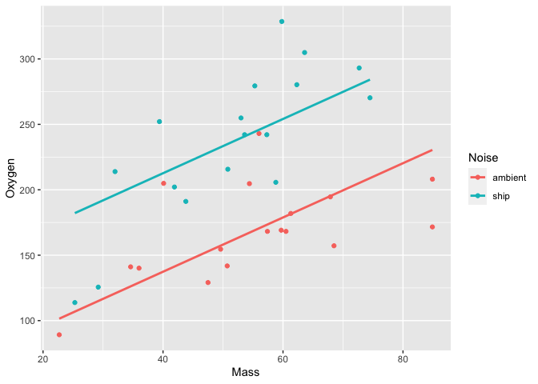

PS07
================

## Section 01

``` r
library(moderndive)
library(Stat2Data)
library(ggplot2)
data("Cereal")
data("CrabShip")
```


## The relationship between Oxygen consumption and crabs’ mass

``` r
ggplot(CrabShip, aes(x=Mass,y=Oxygen, color= Noise))+ 
  geom_point() +
geom_parallel_slopes(se=FALSE, formula=y~x)
```

<!-- -->
